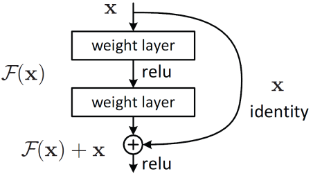

Aug 2021 - June 2022
# Automated ECG Diagnosis with ResNet

This ResNet Model can automatically diagnose conditions from ECGs with human-level accuracy, so that busy doctors can be alerted when patients require attention.

This model has been trained on 4 important conditions: Atrial Fibrillation (AFib), Atrial Flutter (AFl), Supraventricular Tachycardia (SVT), and Myocardial Infarction (MI). Their Sensitivity (Sn), or true-positive, and Specificity (Sp), or true-negative, rates on out-of-sample test sets (20% of total dataset) are below:
```
AFib -  Sn: 95.0%, Sp: 84.7%
AFl  -  Sn: 90.8%, Sp: 98.3%
SVT  -  Sn: 88.8%, Sp: 99.3%
MI:  -  Sn: 94.2%, Sp: 91.0%
```
Refer to this README for a summary of the implementation, or view the notebooks for in-depth description.

## Data & Preprocessing

A total of 121,149 12-Lead ECG tracings from different countries were obtained from open-source databases:
```
1. CPSC Database: 13,256
2. INCART Database: 74
3. PTB and PTB-XL Database: 22,353
4. Georgia ECG Database: 20,672
5. Chapman-Shaoxing and Ningbo Database: 45,152
6. UMich Database: 19,642
```
The data can be downloaded from https://physionetchallenges.org/2021/. A sample of a 12-Lead ECG as displayed on a conventional hospital ECG paper would look something like this:


Preprocessing included reading the ECG metadata from the associated .mat files, before filtering out tracings which had unsuitable lenghts or data formats. A DataFrame of the final dataset was constructed that included the filepath and the labels for the 4 conditions and was saved into "full_dataset.csv".

## ResNet Model Overview

A ResNet employs skip-connections to mitigate the problem of vanishing gradients and allow for larger and larger models to train well. A simple illustration of a skip-connection is shown below:



A 1D CNN with a ResNet architecture was used, as it seemed to perform best based on literature. To prevent overfitting, a relatively small model of less than 500,000 weights with just 3 Residual Blocks was used.

## Training

Four different models were trained for each of the conditions to ensure highest accuracy. Running their respective jupyter notebooks after generating the "full_dataset.csv" file will execute the steps required to train the model. Some of the key steps in the training are detailed below:

1. Data Augmentation: Common ECG noise was randomly added to training samples to increase robustness.
2. Upsampling: ECGs with a condition is always in the minority; upsampling was done for greater class balance.
3. Data Loader: tf.data.Dataset class was used to load the ECG data at point of training based on the filepath.
4. Reduce Overfitting: (a) add L2 regularization to Conv Layer, (b) add DropOut after each Conv Layer, (c) use Label Smooring to prevent overconfident predictions, (d) add class weights to further balance data.

## Model Usage

The trained models are stored in the folder "models" and can be loaded by running the following command:
```
tf.keras.models.load_model()
```
